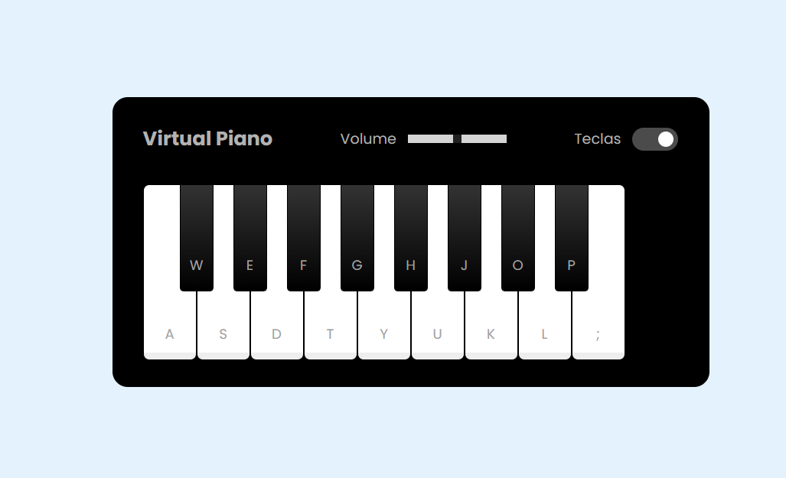

# Piano Virtual

Piano virtual criado em HTML, CSS e JavaScript.

## 📖 Sobre

Um piano virtual ao qual se aperta em suas teclas para emitir sons.

## 🛠 Recursos utilizados

- HTML e CSS para a estrutura da página e aparência.
- JavaScript para o funcionamento do piano.

## 🖼 Visão geral

## 📁 Referências

- [DIO Jogo da Memória](https://github.com/felipeAguiarCode/js-music-keyboard-virtual)
